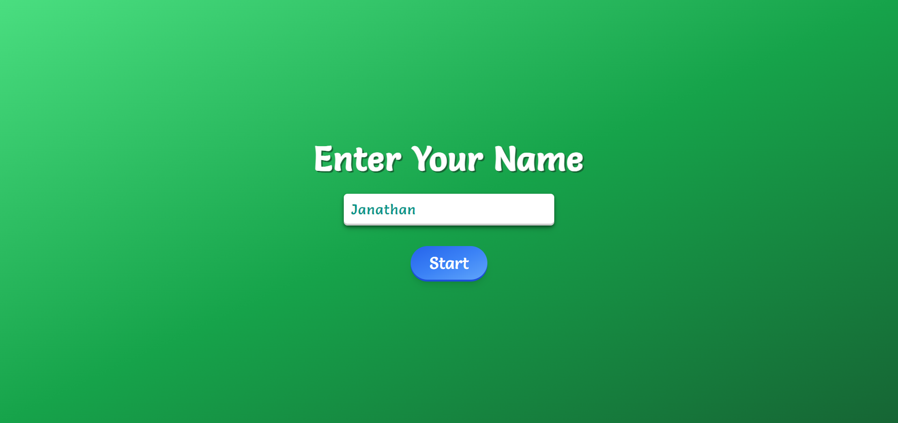
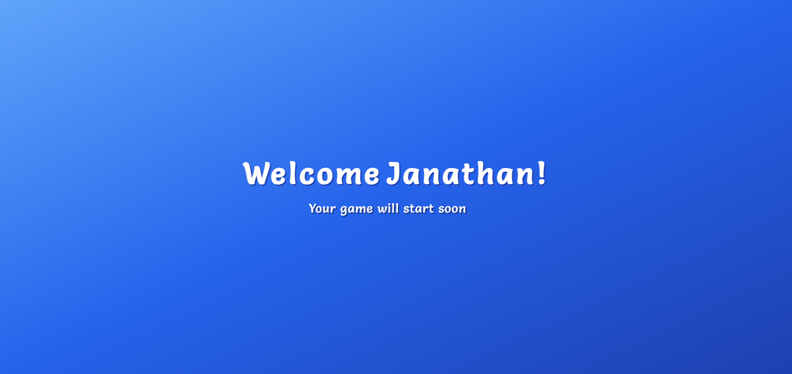
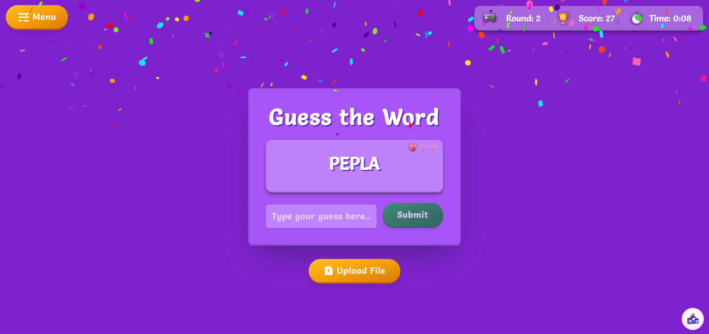
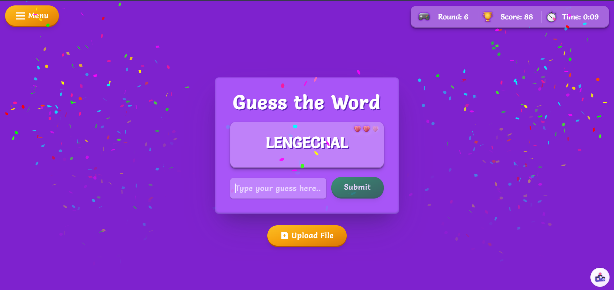
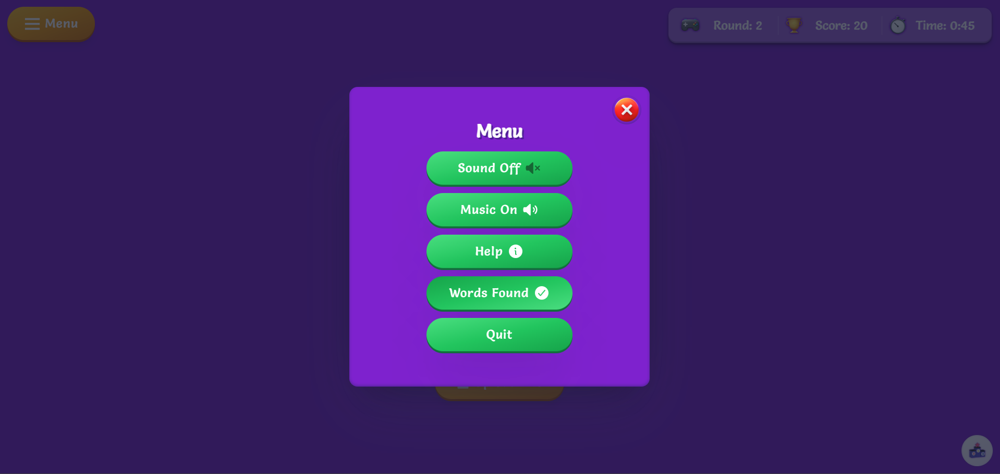
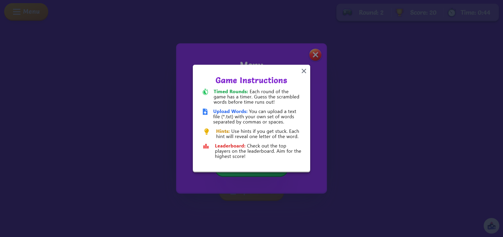
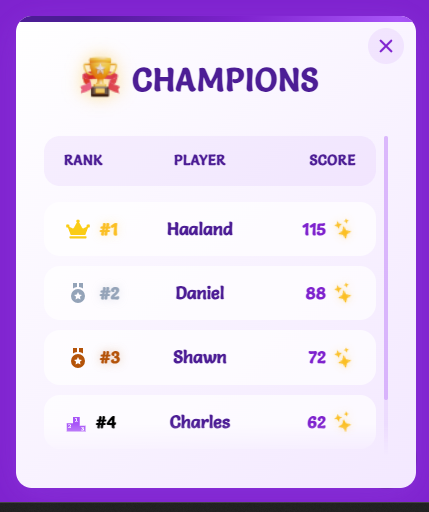

# 🎮 Word Scramble Game [[Live Preview](https://word-scramble-live.netlify.app/)]

A fun and engaging word scramble game built with React, featuring both classic and custom word modes, with sound effects and animations to enhance the gaming experience.

### HomeScreen

https://github.com/user-attachments/assets/6b40283e-78da-4b8e-a26e-d2807c548a76

### NameEntryPage



### LoadingScreen



### PlayScreen





### MenuScreen



### GameInstructionScreen



### WordsListScreen


## Leaderboard



<br>

## ✨ Features

### 🎯 Main Game Features

- 🎲 Classic mode with progressive difficulty
- 📝 Custom word list support
- ❤️ Lives system with 3 attempts
- ⏳ Time-based challenges
- 🏆 Local leaderboard tracking

<br>

## 🎮 Game Modes

### Classic Mode

- Progressive word length (4-10 letters)
- Difficulty increases every 1 rounds
- Score multipliers based ON word length

### Custom Mode

- Upload your own word list
- Infinite rounds

<br>

## 🚀 Getting Started

### Prerequisites

- Node.js 18.x or higher
- npm or yarn package manager

### Installation

1. Clone the repository:
   ```sh
   git clone https://github.com/VinayShetyeOfficial/word-scramble-game.git
   ```
2. Navigate to the project directory:
   ```sh
   cd word-scramble-game
   ```
3. Install dependencies:
   ```sh
   npm install
   ```
4. Run the development server:
   ```sh
   npm run dev
   ```

<br>

## 🎵 Audio Features

### Sound System

The game includes:

- Background music
- Interactive sound effects
- Victory and failure sounds
- UI feedback sounds

### Audio Controls

- Toggle background music
- Adjust sound effect volume
- Mute all audio
- Custom sound themes

<br>

## 📁 Project Structure

```
word-scramble-game/
│── src/
│   ├── components/
│   ├── assets/
│   ├── utils/
│   ├── App.js
│   ├── index.js
│── public/
│── package.json
└── README.md
```

<br>

## 🛠️ Future Enhancements

Planned features:

- Online multiplayer mode
- Additional word categories
- Achievement system
- Mobile app version
- Social sharing features

<br>

## 🤝 Contributing

Contributions are welcome! Please feel free to submit a Pull Request.

1. Fork the project
2. Create your feature branch:
   ```sh
   git checkout -b feature/AmazingFeature
   ```
3. Commit your changes:
   ```sh
   git commit -m 'Add some AmazingFeature'
   ```
4. Push to the branch:
   ```sh
   git push origin feature/AmazingFeature
   ```
5. Open a Pull Request

<br>

## Acknowledgments

- Word lists from various open-source dictionaries
- Sound effects from open-source audio libraries
- Inspired by classic word games

---

> [!NOTE]  
> This game is designed for entertainment and educational purposes.

<br>

## 📝 License

This project is licensed under the MIT License - see the [LICENSE](LICENSE) file for details.

<br>

## 📧 Contact

Vinay Shetye - [GitHub](https://github.com/VinayShetyeOfficial) - vinay.shetye.personal@outlook.com <br>
Project Link: [https://github.com/VinayShetyeOfficial/word-scramble-game](https://github.com/VinayShetyeOfficial/word-scramble-game)
